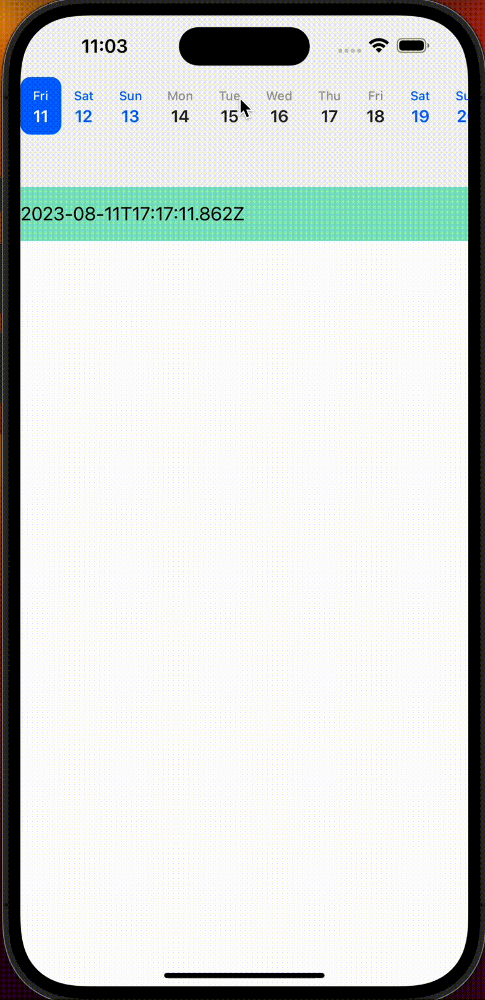

<div align="center" id="top"> 
  

  &#xa0;

  <!-- <a href="https://reactnative_horizontal_calender.netlify.app">Demo</a> -->
</div>

<h1 align="center">React Native Horizontal Calender</h1>

<p align="center">
  

  

  

  

  <!--  -->

  <!--  -->

  <!--  -->
</p>

<!-- Status -->

<!-- <h4 align="center"> 
	🚧  React Native_horizontal_calender 🚀 Under construction...  🚧
</h4> 

<hr> -->


## :dart:  About ##

Describe your project

## :dart: Demo ##

<br>

## :dart:  Installation ##
```
npm i react-native_horizontal_calender
```

## :dart:  Example ##
```javascript
function App(): JSX.Element {
 
  const [receivedDate, setReceivedDate] = useState<Date>(currentDate);

  const handleDataFromCalender = (date:Date) => {
    console.log('date',date)
    setReceivedDate(date);
  };

  return (
    <View>
      <HorizontalCalender
        onPressed={handleDataFromCalender}
        populateDatesOnLastDateSelect={true}
        userSelectedDate={currentDate}
        startingDate={currentDate}
        numberOfDays={10}
      />
      <Text style={styles.sectionDescription}>{receivedDate.toISOString() }</Text>
    </View>
  );
}
```

## :dart:  Platform Support ##

Supports both Android and iOS.

## :dart:  Props ##

| Prop                 | Type   | Optional       | Default      | Description                                                                            |
| -------------------- | ------ | --------       | ------------ | -------------------------------------------------------------------------------------- |
| userSelectedDate     | Date   | No             | n/a          | User current date or selected date                                                     |
| onPressed            | (date: Date) => void    | No       | n/a | callback which provides selected date as an argument.                                |
| startingDate         | Date   | No             | n/a          | Starting point of the calender| 
| numberOfDays         | number | Yes            | 10           | Number of days you want to populate| 
| populateDatesOnLastDateSelect | boolean   | Yes      | true        | Use this value if you want to populate dates further on last date select| 
| horizontal | boolean   | Yes      | true          | Show calender horizontal or not| 


## :dart:  License ##

This project is under license from MIT. For more details, see the [LICENSE](LICENSE.md) file.


Made with :heart: by <a href="https://github.com/shreyj786" target="_blank">Shrey Jain</a>

&#xa0;

<a href="#top">Back to top</a>
